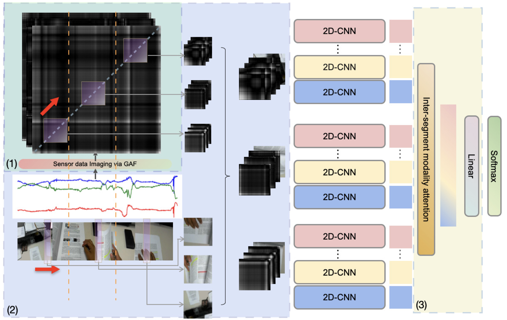

# MMTSA
>Ziqi Gao*, Yuntao Wang*, Jianguo Chen, Junliang Xing, Shwetak Patel, Xin Liu, Yuanchun Shi

This is an official code repository for our paper **MMTSA: Multi-Modal Temporal Segment Attention Network for Efficient Human Activity Recognition**.

In this paper, we proposed an efficient multimodal neural architecture for HAR using an RGB camera and inertial measurement units (IMUs) called Multimodal Temporal Segment Attention Network (MMTSA). MMTSA first transforms IMU sensor data into a temporal and structure-preserving gray-scale image using the Gramian Angular Field (GAF), representing the inherent properties of human activities. MMTSA then applies a multimodal sparse sampling method to reduce data redundancy. Lastly, MMTSA adopts an inter-segment attention module for efficient multimodal fusion.



## Citing
When using this code, kindly reference:

```
@article{gao2023mmtsa,
  title={MMTSA: Multi-Modal Temporal Segment Attention Network for Efficient Human Activity Recognition},
  author={Gao, Ziqi and Wang, Yuntao and Chen, Jianguo and Xing, Junliang and Patel, Shwetak and Liu, Xin and Shi, Yuanchun},
  journal={Proceedings of the ACM on Interactive, Mobile, Wearable and Ubiquitous Technologies},
  volume={7},
  number={3},
  pages={1--26},
  year={2023},
  publisher={ACM New York, NY, USA}
}
```

## Acknowledgements
The codebase was built on top of [TBN](https://github.com/ekazakos/temporal-binding-network). Many thanks to Kazakos et. al for previous work.

